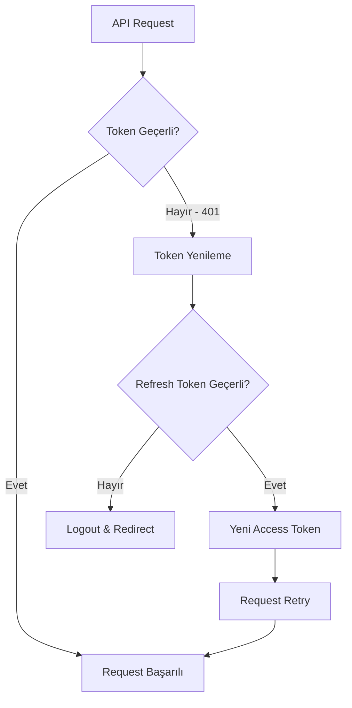

# 🔐 Token Yönetimi ve Güvenlik Sistemi

<div align="center">


*Modern ve güvenli JWT token yönetimi için kapsamlı rehber*

</div>

---

## 📋 İçindekiler

- [🎯 Genel Bakış](#-genel-bakış)
- [🔄 Otomatik Token Yenileme](#-otomatik-token-yenileme)
- [⚡ Hızlı Başlangıç](#-hızlı-başlangıç)
- [🏗️ Mimarı](#️-mimari)
- [💡 Kullanım Örnekleri](#-kullanım-örnekleri)
- [🔒 Güvenlik Önlemleri](#-güvenlik-önlemleri)
- [🐛 Sorun Giderme](#-sorun-giderme)

---

## 🎯 Genel Bakış

Bu sistemde **JWT (JSON Web Token)** tabanlı bir authentication ve authorization yapısı kullanılmaktadır. Sistem, kullanıcı deneyimini bozmadan token'ları otomatik olarak yeniler ve güvenliği maksimum seviyede tutar.

### ✨ Özellikler

| Özellik | Açıklama | Durum |
|---------|----------|-------|
| 🔄 **Otomatik Yenileme** | Token süresi dolduğunda otomatik yenileme | ✅ Aktif |
| 🚦 **Concurrent Handling** | Aynı anda birden fazla request desteği | ✅ Aktif |
| 🛡️ **Güvenli Saklama** | Token'ları güvenli şekilde saklama | ✅ Aktif |
| ⚡ **Hızlı Retry** | Başarısız request'leri otomatik tekrar deneme | ✅ Aktif |
| 📊 **Token Durumu** | Token süresi ve durumu izleme | ✅ Aktif |

---

## 🔄 Otomatik Token Yenileme

### 🎬 Nasıl Çalışır?



### 🔧 Teknik Implementasyon

#### 1. Response Interceptor

```typescript
// 🎯 Ana interceptor mekanizması
axiosInstance.interceptors.response.use(
  (response) => {
    // ✅ Başarılı response'lar direkt geçer
    return response;
  },
  async (error) => {
    const originalRequest = error.config;

    // 🚨 401 hatası algılandı ve henüz retry yapılmadı
    if (error.response?.status === 401 && !originalRequest._retry) {
      originalRequest._retry = true;
      
      try {
        // 🔄 Refresh token ile yeni access token al
        const refreshResponse = await authApiService.refreshToken();
        const newAccessToken = refreshResponse.accessToken;
        
        // 💾 Yeni token'ı güvenli şekilde kaydet
        localStorage.setItem('accessToken', newAccessToken);
        
        // 🔁 Başarısız olan request'i yeni token ile tekrar dene
        originalRequest.headers.Authorization = `Bearer ${newAccessToken}`;
        return axiosInstance(originalRequest);
        
      } catch (refreshError) {
        // ❌ Refresh token da geçersizse temizlik yap ve logout
        localStorage.removeItem('accessToken');
        localStorage.removeItem('refreshToken');
        window.location.href = '/login';
        return Promise.reject(refreshError);
      }
    }
    
    return Promise.reject(error);
  }
);
```

#### 2. Concurrent Request Protection

Aynı anda birden fazla request 401 aldığında token yenileme işleminin sadece bir kez yapılmasını sağlar:

```typescript
// 🔐 Eşzamanlı request koruma sistemi
let isRefreshing = false;
let failedQueue: Array<{
  resolve: (token: string) => void;
  reject: (error: any) => void;
}> = [];

const processQueue = (error: any, token: string | null = null) => {
  failedQueue.forEach(({ resolve, reject }) => {
    if (error) {
      reject(error);
    } else {
      resolve(token!);
    }
  });
  
  failedQueue = [];
};

// 🎯 Gelişmiş interceptor
axiosInstance.interceptors.response.use(
  (response) => response,
  async (error) => {
    const originalRequest = error.config;

    if (error.response?.status === 401 && !originalRequest._retry) {
      
      // 🔄 Eğer zaten yenileme yapılıyorsa, kuyruğa ekle
      if (isRefreshing) {
        return new Promise((resolve, reject) => {
          failedQueue.push({ 
            resolve: (token: string) => {
              originalRequest.headers.Authorization = `Bearer ${token}`;
              resolve(axiosInstance(originalRequest));
            },
            reject 
          });
        });
      }

      originalRequest._retry = true;
      isRefreshing = true;

      return new Promise((resolve, reject) => {
        authApiService.refreshToken()
          .then(({ accessToken }) => {
            // 💾 Token'ı güncelle
            localStorage.setItem('accessToken', accessToken);
            axiosInstance.defaults.headers.common['Authorization'] = `Bearer ${accessToken}`;
            originalRequest.headers.Authorization = `Bearer ${accessToken}`;
            
            // 🎉 Kuyruktaki tüm request'leri işle
            processQueue(null, accessToken);
            resolve(axiosInstance(originalRequest));
          })
          .catch((err) => {
            processQueue(err, null);
            // 🧹 Temizlik işlemleri
            localStorage.removeItem('accessToken');
            localStorage.removeItem('refreshToken');
            window.location.href = '/login';
            reject(err);
          })
          .finally(() => {
            isRefreshing = false;
          });
      });
    }
    
    return Promise.reject(error);
  }
);
```

---

## ⚡ Hızlı Başlangıç

### 1. 🚀 Temel Kurulum

```typescript
// 📁 src/utils/axios.ts
import axios from 'axios';

const axiosInstance = axios.create({
  baseURL: process.env.VITE_API_BASE_URL,
  timeout: 10000,
  headers: {
    'Content-Type': 'application/json',
  },
});

// 🔑 Token ekleme interceptor'u
axiosInstance.interceptors.request.use(
  (config) => {
    const token = localStorage.getItem('accessToken');
    if (token) {
      config.headers.Authorization = `Bearer ${token}`;
    }
    return config;
  },
  (error) => Promise.reject(error)
);
```

### 2. 🎣 Hook ile Kullanım

```tsx
// 📁 src/hooks/useAuth.ts
import { useState, useEffect } from 'react';
import { authApiService } from '../services';

export const useAuth = () => {
  const [user, setUser] = useState(null);
  const [isAuthenticated, setIsAuthenticated] = useState(false);
  const [loading, setLoading] = useState(true);

  // 📊 Token durumu kontrolü
  const checkTokenExpiry = () => {
    const token = localStorage.getItem('accessToken');
    if (!token) return false;
    
    try {
      const payload = JSON.parse(atob(token.split('.')[1]));
      const now = Date.now() / 1000;
      return payload.exp > now;
    } catch {
      return false;
    }
  };

  const login = async (credentials: LoginCredentials) => {
    setLoading(true);
    try {
      const response = await authApiService.login(credentials);
      
      // 💾 Token'ları kaydet
      localStorage.setItem('accessToken', response.accessToken);
      localStorage.setItem('refreshToken', response.refreshToken);
      
      setUser(response.user);
      setIsAuthenticated(true);
      
      return response;
    } catch (error) {
      throw error;
    } finally {
      setLoading(false);
    }
  };

  const logout = () => {
    // 🧹 Temizlik işlemleri
    localStorage.removeItem('accessToken');
    localStorage.removeItem('refreshToken');
    setUser(null);
    setIsAuthenticated(false);
  };

  return {
    user,
    isAuthenticated,
    loading,
    login,
    logout,
    checkTokenExpiry
  };
};
```

---

## 🏗️ Mimari

### 🎯 Sistem Bileşenleri

```
🏢 Token Management Architecture
├── 🔧 Axios Interceptors
│   ├── Request Interceptor (Token ekleme)
│   └── Response Interceptor (Hata yakalama & retry)
├── 🎣 React Hooks
│   ├── useAuth (Authentication)
│   └── useApi (API çağrıları)
├── 🔐 Token Services
│   ├── Token validation
│   ├── Token refresh
│   └── Token cleanup
└── 💾 Storage Management
    ├── LocalStorage (Tokens)
    └── Memory (User state)
```

### 🔄 Token Lifecycle

```typescript
// 🎯 Token yaşam döngüsü yönetimi
interface TokenLifecycle {
  // 1️⃣ Başlangıç
  initialize: () => void;
  
  // 2️⃣ Login
  authenticate: (credentials: LoginCredentials) => Promise<AuthResponse>;
  
  // 3️⃣ Otomatik yenileme
  autoRefresh: () => Promise<string>;
  
  // 4️⃣ Manuel yenileme
  manualRefresh: () => Promise<string>;
  
  // 5️⃣ Temizlik
  cleanup: () => void;
}
```

---

## 💡 Kullanım Örnekleri

### 🔐 1. Authentication Component

```tsx
import React, { useState } from 'react';
import { useAuth } from '../hooks';

const AuthenticationCard = () => {
  const { login, logout, user, isAuthenticated, loading } = useAuth();
  const [credentials, setCredentials] = useState({ email: '', password: '' });

  const handleLogin = async (e: React.FormEvent) => {
    e.preventDefault();
    try {
      await login(credentials);
      // ✅ Başarılı giriş - token otomatik olarak saklandı
    } catch (error) {
      console.error('❌ Giriş hatası:', error);
    }
  };

  if (loading) {
    return (
      <div className="flex items-center justify-center p-8">
        <div className="animate-spin rounded-full h-8 w-8 border-b-2 border-blue-600"></div>
        <span className="ml-2">Yükleniyor...</span>
      </div>
    );
  }

  return (
    <div className="max-w-md mx-auto bg-white rounded-xl shadow-md overflow-hidden">
      <div className="p-6">
        {isAuthenticated ? (
          <div className="text-center">
            <div className="mb-4">
              <div className="w-16 h-16 bg-green-100 rounded-full flex items-center justify-center mx-auto mb-3">
                <span className="text-2xl">👤</span>
              </div>
              <h3 className="text-lg font-semibold text-gray-900">
                Hoş geldiniz, {user?.name}!
              </h3>
              <p className="text-sm text-gray-600">
                Oturumunuz güvende ve otomatik yenileniyor
              </p>
            </div>
            <button
              onClick={logout}
              className="w-full bg-red-600 text-white py-2 px-4 rounded-lg hover:bg-red-700 transition-colors"
            >
              🚪 Çıkış Yap
            </button>
          </div>
        ) : (
          <form onSubmit={handleLogin} className="space-y-4">
            <h2 className="text-2xl font-bold text-center text-gray-900 mb-6">
              🔐 Giriş Yap
            </h2>
            <div>
              <input
                type="email"
                placeholder="📧 E-posta"
                value={credentials.email}
                onChange={(e) => setCredentials(prev => ({ ...prev, email: e.target.value }))}
                className="w-full px-4 py-2 border border-gray-300 rounded-lg focus:ring-2 focus:ring-blue-500 focus:border-transparent"
                required
              />
            </div>
            <div>
              <input
                type="password"
                placeholder="🔒 Şifre"
                value={credentials.password}
                onChange={(e) => setCredentials(prev => ({ ...prev, password: e.target.value }))}
                className="w-full px-4 py-2 border border-gray-300 rounded-lg focus:ring-2 focus:ring-blue-500 focus:border-transparent"
                required
              />
            </div>
            <button
              type="submit"
              disabled={loading}
              className="w-full bg-blue-600 text-white py-2 px-4 rounded-lg hover:bg-blue-700 disabled:opacity-50 transition-colors"
            >
              {loading ? '⏳ Giriş yapılıyor...' : '🚀 Giriş Yap'}
            </button>
          </form>
        )}
      </div>
    </div>
  );
};
```

### 📊 2. Token Status Monitor

```tsx
import React, { useState, useEffect } from 'react';
import { useAuth } from '../hooks';

const TokenStatusMonitor = () => {
  const { user, isAuthenticated } = useAuth();
  const [tokenExpiry, setTokenExpiry] = useState<Date | null>(null);
  const [timeRemaining, setTimeRemaining] = useState<string>('');

  useEffect(() => {
    const checkTokenExpiry = () => {
      const token = localStorage.getItem('accessToken');
      if (!token) return;
      
      try {
        const payload = JSON.parse(atob(token.split('.')[1]));
        const expiry = new Date(payload.exp * 1000);
        setTokenExpiry(expiry);
      } catch (error) {
        console.error('Token parse hatası:', error);
      }
    };

    checkTokenExpiry();
    const interval = setInterval(checkTokenExpiry, 30000); // 30 saniyede bir kontrol

    return () => clearInterval(interval);
  }, [isAuthenticated]);

  useEffect(() => {
    if (!tokenExpiry) return;

    const updateTimer = () => {
      const now = new Date();
      const diff = tokenExpiry.getTime() - now.getTime();
      
      if (diff <= 0) {
        setTimeRemaining('Süresi dolmuş');
        return;
      }

      const minutes = Math.floor(diff / (1000 * 60));
      const seconds = Math.floor((diff % (1000 * 60)) / 1000);
      setTimeRemaining(`${minutes}:${seconds.toString().padStart(2, '0')}`);
    };

    updateTimer();
    const timer = setInterval(updateTimer, 1000);

    return () => clearInterval(timer);
  }, [tokenExpiry]);

  const getStatusColor = () => {
    if (!tokenExpiry) return 'gray';
    const now = new Date();
    const diff = tokenExpiry.getTime() - now.getTime();
    const minutes = diff / (1000 * 60);
    
    if (minutes <= 5) return 'red';
    if (minutes <= 15) return 'yellow';
    return 'green';
  };

  if (!isAuthenticated) {
    return (
      <div className="p-4 bg-gray-100 rounded-lg border">
        <div className="flex items-center">
          <span className="w-3 h-3 bg-gray-400 rounded-full mr-2"></span>
          <span className="text-gray-600">Oturum açılmamış</span>
        </div>
      </div>
    );
  }

  const statusColor = getStatusColor();
  const colorClasses = {
    red: 'bg-red-100 border-red-200 text-red-800',
    yellow: 'bg-yellow-100 border-yellow-200 text-yellow-800',
    green: 'bg-green-100 border-green-200 text-green-800',
    gray: 'bg-gray-100 border-gray-200 text-gray-800'
  };

  return (
    <div className={`p-4 rounded-lg border ${colorClasses[statusColor]}`}>
      <div className="flex items-center justify-between">
        <div className="flex items-center">
          <span className={`w-3 h-3 rounded-full mr-2 ${
            statusColor === 'red' ? 'bg-red-500' :
            statusColor === 'yellow' ? 'bg-yellow-500' :
            statusColor === 'green' ? 'bg-green-500' : 'bg-gray-500'
          }`}></span>
          <span className="font-medium">Token Durumu</span>
        </div>
        <div className="text-right">
          <div className="text-sm font-mono">{timeRemaining}</div>
          <div className="text-xs opacity-75">kalan süre</div>
        </div>
      </div>
      {statusColor === 'red' && (
        <div className="mt-2 text-sm">
          ⚠️ Token yakında sona erecek - otomatik yenilenecek
        </div>
      )}
    </div>
  );
};
```

### 🔄 3. Manuel Token Yenileme

```tsx
import React, { useState } from 'react';
import { authApiService } from '../services';

const ManualTokenRefresh = () => {
  const [isRefreshing, setIsRefreshing] = useState(false);
  const [lastRefresh, setLastRefresh] = useState<Date | null>(null);

  const handleRefreshToken = async () => {
    setIsRefreshing(true);
    try {
      const response = await authApiService.refreshToken();
      console.log('✅ Token başarıyla yenilendi:', response.accessToken);
      setLastRefresh(new Date());
      
      // 🎉 Başarı bildirimi
      // Toast veya bildirim sisteminiz varsa burada kullanın
      
    } catch (error) {
      console.error('❌ Token yenileme hatası:', error);
      // 🚨 Hata bildirimi
      
    } finally {
      setIsRefreshing(false);
    }
  };

  return (
    <div className="p-4 bg-white rounded-lg border border-gray-200">
      <h3 className="text-lg font-semibold mb-4">🔄 Manuel Token Yenileme</h3>
      
      <div className="space-y-3">
        <button
          onClick={handleRefreshToken}
          disabled={isRefreshing}
          className="w-full bg-blue-600 text-white py-2 px-4 rounded-lg hover:bg-blue-700 disabled:opacity-50 disabled:cursor-not-allowed transition-colors flex items-center justify-center"
        >
          {isRefreshing ? (
            <>
              <div className="animate-spin rounded-full h-4 w-4 border-b-2 border-white mr-2"></div>
              Yenileniyor...
            </>
          ) : (
            <>
              🔄 Token'ı Yenile
            </>
          )}
        </button>
        
        {lastRefresh && (
          <div className="text-sm text-gray-600 text-center">
            Son yenileme: {lastRefresh.toLocaleTimeString('tr-TR')}
          </div>
        )}
        
        <div className="text-xs text-gray-500 text-center">
          💡 Normal şartlarda token'lar otomatik yenilenir
        </div>
      </div>
    </div>
  );
};
```

---

## 🔒 Güvenlik Önlemleri

### 🛡️ Best Practices

| 📋 Kural | ✅ Yapılması Gereken | ❌ Yapılmaması Gereken |
|----------|---------------------|----------------------|
| **Token Saklama** | LocalStorage kullan (demo için) | Plain text olarak sakla |
| **Token Rotation** | Her yenilemede token'ları değiştir | Aynı token'ı tekrar kullan |
| **Timeout Handling** | Uygun timeout değerleri ayarla | Sonsuz bekletme |
| **Error Handling** | Tüm hata durumlarını yakala | Hataları görmezden gel |
| **HTTPS** | Sadece HTTPS kullan | HTTP üzerinden token gönder |

### 🔐 Güvenlik Kontrol Listesi

```typescript
// ✅ Güvenlik kontrolleri
const securityChecks = {
  // 1. Token format kontrolü
  validateTokenFormat: (token: string): boolean => {
    return /^[A-Za-z0-9-_]+\.[A-Za-z0-9-_]+\.[A-Za-z0-9-_]+$/.test(token);
  },

  // 2. Token süresi kontrolü
  isTokenExpired: (token: string): boolean => {
    try {
      const payload = JSON.parse(atob(token.split('.')[1]));
      return Date.now() >= payload.exp * 1000;
    } catch {
      return true; // Geçersiz token = süresi dolmuş
    }
  },

  // 3. Token payload kontrolü
  validateTokenPayload: (token: string): boolean => {
    try {
      const payload = JSON.parse(atob(token.split('.')[1]));
      return payload.sub && payload.exp && payload.iat;
    } catch {
      return false;
    }
  },

  // 4. Güvenli temizlik
  secureCleanup: (): void => {
    ['accessToken', 'refreshToken', 'user'].forEach(key => {
      localStorage.removeItem(key);
    });
    // Session storage da temizle
    sessionStorage.clear();
  }
};
```

---

## 🐛 Sorun Giderme

### ❓ Sık Karşılaşılan Sorunlar

<details>
<summary><strong>🔴 Token sürekli yenilenmiyor</strong></summary>

**Olası Nedenler:**
- Refresh token süresi dolmuş
- API endpoint'i yanlış
- Network bağlantı sorunu

**Çözüm:**
```typescript
// Debug için log ekleyin
console.log('Refresh token:', localStorage.getItem('refreshToken'));
console.log('API endpoint:', process.env.VITE_API_BASE_URL);

// Network durumunu kontrol edin
navigator.onLine ? console.log('✅ Online') : console.log('❌ Offline');
```
</details>

<details>
<summary><strong>🟡 Aynı anda birden fazla request problemi</strong></summary>

**Olası Nedenler:**
- Concurrent request handling çalışmıyor
- Multiple interceptor tanımları

**Çözüm:**
```typescript
// Interceptor'ın sadece bir kez tanımlandığından emin olun
if (!axiosInstance.interceptors.response.handlers.length) {
  axiosInstance.interceptors.response.use(/* ... */);
}
```
</details>

<details>
<summary><strong>🟢 Token manual yenileme çalışmıyor</strong></summary>

**Olası Nedenler:**
- Refresh token mevcut değil
- API authorization hatası

**Çözüm:**
```typescript
// Token varlığını kontrol edin
const refreshToken = localStorage.getItem('refreshToken');
if (!refreshToken) {
  console.error('❌ Refresh token bulunamadı');
  // Login sayfasına yönlendir
  window.location.href = '/login';
}
```
</details>

### 🔍 Debug Araçları

```typescript
// 🛠️ Token debug utility
const TokenDebugger = {
  logTokenInfo: () => {
    const accessToken = localStorage.getItem('accessToken');
    const refreshToken = localStorage.getItem('refreshToken');
    
    console.group('🔍 Token Debug Info');
    console.log('Access Token:', accessToken ? '✅ Mevcut' : '❌ Yok');
    console.log('Refresh Token:', refreshToken ? '✅ Mevcut' : '❌ Yok');
    
    if (accessToken) {
      try {
        const payload = JSON.parse(atob(accessToken.split('.')[1]));
        console.log('Token Expiry:', new Date(payload.exp * 1000));
        console.log('Time Remaining:', Math.max(0, payload.exp * 1000 - Date.now()), 'ms');
      } catch (e) {
        console.error('❌ Token parse hatası:', e);
      }
    }
    console.groupEnd();
  },

  clearAllTokens: () => {
    localStorage.removeItem('accessToken');
    localStorage.removeItem('refreshToken');
    console.log('🧹 Tüm token\'lar temizlendi');
  }
};

// Browser console'da kullanım:
// TokenDebugger.logTokenInfo();
// TokenDebugger.clearAllTokens();
```

---

<div align="center">

### 🎉 Tebrikler!

Bu rehberi tamamladığınız için teşekkürler. Artık modern ve güvenli bir token yönetim sisteminiz var!

---

**📚 Daha Fazla Bilgi İçin:**
- [JWT.io - Token Decoder](https://jwt.io/)
- [OWASP JWT Security](https://cheatsheetseries.owasp.org/cheatsheets/JSON_Web_Token_for_Java_Cheat_Sheet.html)
- [RFC 7519 - JWT Standard](https://tools.ietf.org/html/rfc7519)

---

*Son güncelleme: Eylül 2025* 🗓️

</div>
